# Continuous Integration Testing Processes

This document provides a comprehensive overview of our Continuous Integration (CI) testing processes. It explains when and how different test jobs are triggered, where to monitor them, and details about the environments hosting these tests, along with guidance on how to access them.

## GitHub Pull Requests

When a new Pull Request (PR) is opened at [backstage-showcase](https://github.com/janus-idp/backstage-showcase), tests are triggered based on the nature of the changes and the contributor's role.

### Automatic Triggering of Tests

- **Code Changes Affecting Tests:** PR tests are triggered automatically if the changes include code modifications that could impact tests. This means that for PRs involving code that affects functionality or test suites, the CI will automatically initiate the testing process.
- **Documentation-Only Changes:** PRs that involve only documentation updates will skip the tests to conserve CI resources, as they do not affect the codebase or functionality.

### Manual Triggering of Tests

For scenarios where tests are not automatically triggered, or when you need to manually initiate tests (e.g., for draft PRs or external contributions), you can use the following commands:

1. **Commenting `/ok-to-test`:**

   - **Purpose:** This command is used to validate a PR for testing, especially important for external contributors or when tests are not automatically triggered.
   - **Who Can Use It:** Only members of the [janus-idp](https://github.com/janus-idp) GitHub organization can mark the PR with this comment.
   - **Use Cases:**
     - **External Contributors:** For PRs from contributors outside the organization, a member needs to comment `/ok-to-test` to initiate tests.
   - **More Details:** For additional information about `/ok-to-test`, please refer to the [Kubernetes Community Pull Requests Guide](https://github.com/kubernetes/community/blob/master/contributors/guide/pull-requests.md#more-about-ok-to-test).

2. **Triggering Tests Post-Validation:**
   - After a janus-idp member has validated the PR with `/ok-to-test`, anyone can trigger tests using the following commands:
     - `/test`, `/test images`, `/test all` or `/test e2e-tests`

These interactions are picked up by the OpenShift-CI service, which sets up a test environment on the **IBM Cloud**, specifically on an OpenShift Container Platform (OCP) cluster. The configurations and steps for setting up this environment are defined in the `openshift-ci-tests.sh` script. For more details, see the [High-Level Overview of `openshift-ci-tests.sh`](#high-level-overview-of-openshift-ci-testssh).

### Retrying Tests

If the initial automatically triggered tests fail, OpenShift-CI will add a comment to the PR with information on how to retrigger the tests.

### CI Job Definitions

#### Pull Request Test Job

- **Purpose:** Validate new PRs for code quality, functionality, and integration.
- **Trigger:**
  - **Automatic:** When a PR includes code changes affecting tests (excluding doc-only changes), tests are automatically triggered.
  - **Manual:** When `/ok-to-test` is commented by a janus-idp member for external contributors or when `/test`, `/test images`, `/test all` and `/test e2e-tests` is commented after validation.
- **Environment:** Runs on an ephemeral OpenShift cluster on IBM Cloud.
- **Configurations:**
  - Tests are executed on both **RBAC** (Role-Based Access Control) and **non-RBAC** namespaces. Different sets of tests are executed for both the **non-RBAC RHDH instance** and the **RBAC RHDH instance**, each deployed in separate namespaces.
- **Access:** In order to access the environment, you can run the bash at `.ibm/pipelines/ocp-cluster-claim-login.sh`. You will be prompted the prow url (the url from the openshift agent, which looks like https://prow.ci.openshift.org/...). Once you test calimed a cluster, this script will forward the cluster web console url along with the credentials.
- **Steps:**

  1. **Detection:** OpenShift-CI detects the PR event.
  2. **Environment Setup:** The test environment is set up using the `openshift-ci-tests.sh` script (see the [High-Level Overview](#high-level-overview-of-openshift-ci-testssh)).
     - **Cluster Configuration:** Sets up the required namespaces and applies necessary configurations and secrets.
     - **Application Deployment:** Deploys the RHDH instances using Helm charts, tailored to the specific test scenarios.
  3. **Test Execution:**
     - **Running Tests:** Executes test suites using `yarn` commands specified in `package.json`.
     - **Retry Logic:** Individual tests are retried up to 2 times as specified in the Playwright configuration.
  4. **Artifact Collection:**
     - Collects test artifacts (logs, screenshots, recordings).
     - Stores artifacts in the designated `ARTIFACT_DIR` for a retention period of **6 months**.
     - The reports are also sent to _ReportPortal_
  5. **Reporting:**
     - Reports status back to the PR checks.
     - Generates and uploads HTML reports.

- **Artifacts:** Test reports, logs, screenshots, accessible via PR details under **Artifacts**.
- **Notifications:** Status updates posted on the PR.

### GitHub PR Testing Diagram

## Nightly Tests

Nightly tests are run to ensure the stability and reliability of our codebase over time. These tests are executed on different clusters to cover various environments, including both **RBAC** and **non-RBAC**.

### Nightly Test Environments

- **AKS Nightly Tests:** Nightly tests for Azure Kubernetes Service (AKS) run on a dedicated cluster. We do not have AKS PR checks; the AKS environment is exclusively used for nightly runs.
- **IBM Cloud Tests:** All nightly tests for the `main` and `release-1.n`(depending on the latest release versions) branches run against OpenShift clusters on IBM Cloud.
- **GKE Nightly Tests:** Nightly tests on top of Google Kubernetes Engine. As the AKS, GKE is only used for nightly tests.

### Additional Nightly Jobs for Main Branch

The nightly job for the `main` branch also runs against three OpenShift Container Platform (OCP) versions to ensure compatibility and stability across multiple versions. We maintain testing on the three most recent OCP versions. As new OCP versions are released, we will update our testing pipeline to include the latest versions and drop support for older ones accordingly.

> **Note:** The output of the nightly runs, including test results and any relevant notifications, is posted on the Slack channel **`#rhdh-e2e-test-alerts`**.

### CI Job Definitions

#### Nightly Test Job

- **Purpose:** Ensure ongoing stability and detect regressions in different environments.
- **Trigger:** Scheduled to run every night.
- **Environments:**
  - **AKS Nightly Tests:** Runs on the dedicated AKS cluster.
  - **IBM Cloud Nightly Tests:** Runs on OpenShift clusters on IBM Cloud, covering the most recent OCP versions.
- **Configurations:**
  - Tests are executed on both **RBAC** (Role-Based Access Control) and **non-RBAC** namespaces.
- **Steps:**
  1. **Triggering:** Nightly job is triggered on schedule.
  2. **Environment Setup:** Uses the `openshift-ci-tests.sh` script for setting up the environment (see the [High-Level Overview](#high-level-overview-of-openshift-ci-testssh) for more information).
     - **Cluster Selection:** Chooses the appropriate cluster and OCP version based on the job configuration.
     - **Resource Configuration:** Sets up namespaces and configures resources.
     - **Deployment:** Deploys the Red Hat Developer Hub (RHDH) instance and necessary services.
  3. **Test Execution:**
     - Runs full test suites using the `yarn` commands.
     - Tests are executed similarly to the PR tests but may include additional suites.
     - **Retry Logic:** Individual tests are retried up to 2 times as specified in the Playwright configuration.
  4. **Artifact Collection:**
     - Collects and aggregates results.
     - Stores artifacts for later review for a retention period of **6 months**.
  5. **Reporting:**
     - Posts outputs to Slack channel `#rhdh-e2e-test-alerts`.
     - Generates report.
- **Artifacts:** Comprehensive test reports, logs, screenshots.
- **Notifications:** Results posted on Slack.

### Nightly Testing Diagram

## Configuration and Installation of Testing Environments

### Automation Processes

- **Script Used:**

  - **`openshift-ci-tests.sh`**: Automates the setup of the test environment, deployment of RHDH instances, and execution of tests. For more details, refer to the [High-Level Overview of `openshift-ci-tests.sh`](#high-level-overview-of-openshift-ci-testssh).

### High-Level Overview of `openshift-ci-tests.sh`

The `openshift-ci-tests.sh` script (located at [`.ibm/pipelines/openshift-ci-tests.sh`](../../.ibm/pipelines/openshift-ci-tests.sh)) orchestrates the deployment and testing workflow for both PR and nightly jobs. The configuration for the Red Hat Developer Hub instance is managed using `yaml` config files for the application itself and the plugins in use. Those files are located in `.ibm/pipelines/resources`. These files define essential setup details and configurations specific to each test instance, ultimately determining the precise environment for the RHDH deployment.

Additionally, a **test runner** based on a custom Docker image (defined in [this Dockerfile](https://github.com/janus-idp/backstage-showcase/blob/main/.ibm/images/Dockerfile)) is set up as part of the environment. This runner helps standardize the testing environment and provides the necessary dependencies for test execution.

The OpenShift CI definitions for PR checks and nightly runs, as well as execution of `openshift-ci-tests.sh`, are managed here:

- [PR checks and nightly job definitions](https://github.com/openshift/release/tree/master/ci-operator/jobs/janus-idp/backstage-showcase)
- [Configuration definitions](https://github.com/openshift/release/tree/master/ci-operator/config/janus-idp/backstage-showcase)
- [Step registry for job execution](https://github.com/openshift/release/tree/master/ci-operator/step-registry/janus-idp/backstage-showcase)

- **Environment Preparation:** Sets up clusters and namespaces based on job requirements.
- **Deployment:** Deploys RHDH instances using Helm charts.
- **Testing:** Runs end-to-end tests with Playwright.
- **Cleanup and Reporting:** Cleans up resources and collects artifacts after testing.

Detailed steps on how the tests and reports are managed can be found in the `run_tests()` function within the `openshift-ci-tests.sh` script. Additionally, all the different `yarn` commands that trigger various Playwright projects are described in the `package.json` file.

When the test run is complete, the status will be reported under your PR checks.

> **Important:** The environment in which the PR tests are executed is shared and ephemeral. All PR tests queue for the same environment, which is destroyed and recreated for each PR. Test outputs (screenshots, recordings, walkthroughs, etc.) are stored for a retention period of **6 months** and can be accessed by checking the **Details -> Artifacts** of the test check on the PR.

### Automated Steps

- **Environment Setup:**
  - **PR Tests:** Ephemeral environments are automatically created and destroyed per test run.
  - **Nightly Tests:** Use long-running clusters with automated updates, including multiple OCP versions (usually the current and the previous two).
- **Deployment:**
  - RHDH instances are deployed using automated scripts and Helm charts.
- **Test Execution:**
  - Tests are executed using `yarn` scripts defined in `package.json`.
- **Cleanup:**
  - The script cleans up all temporary resources after tests.
- **Reporting:**
  - Generates reports and stores artifacts for **6 months**.
  - Nightly test results are posted to Slack channel `#rhdh-e2e-test-alerts`.

### Configuration Details

- **Environment Variables and Secrets:**
  Stored securely in the **OpenShift-CI Vault** and accessed during runtime. Members of the organization can ask its peers for details about where and how to access this information.
- **Cluster Credentials:**
  The script sets cluster URLs, tokens, and selects the appropriate OCP version based on job requirements.
- **Namespace and Resource Management:**
  Handles creation and deletion of namespaces and applies necessary Kubernetes resources.
- **Dependency Management:**
  Installs required tools like `oc`, `kubectl`, and `helm` if not already available.
