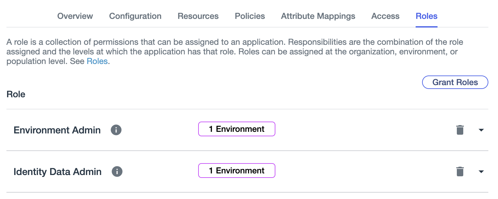

# Ping Identity Environment and Application Setup

This script populates the Ping Identity environment with desired users/groups to test the [Ping Identity catalog plugin](https://github.com/backstage/community-plugins/tree/main/workspaces/pingidentity/plugins/catalog-backend-module-pingidentity). This would avoid the need to manually set up the environment each time the Ping Identity trial expires and a new account is required.

This script adds the following users and groups by default, modify the script as needed to test different scenarios. Read more about how the PingOne API for identity management [here](https://apidocs.pingidentity.com/pingone/platform/v1/api/#identity-management).

### Prerequisite: Setting up the environment

#### Create the environment in the PingOne console

1. In the `Environments` tab, press `+` to create a new environment
2. Select `Customer solution` and fill in the mandatory fields

### Prerequisite: Creating the application

#### Create the application in the PingOne console

1. Navigate to `Applications` > `Application` then press `+` to create a new application
2. Input the application name
3. Select the `Worker` application type (this is required to make API calls)

#### Enter the required IDs/secrets

1. Click the newly created application and navigate to the `Configuration` tab. Copy the respective values and paste the `Client ID`, `Client Secret` and `Environment ID` in `ping-identity-secrets.env`.
2. Ensure the API and Auth path matches the domain of your environment. See [PingOne API Domains](https://apidocs.pingidentity.com/pingone/platform/v1/api/#working-with-pingone-apis) for more information.

### Granting API permissions to the application

#### Obtain and enter the access token to run the script

1. Enable the application using the toggle
2. Navigate to the Roles tab
3. Grant the following roles to the application: `Environment Admin` & `Identity Data Admin`

### Running the script

#### The script takes 3 arguments

1. The path to the secrets file (e.g. `ping-identity-secrets.env`) with the required secrets filled out
2. The number of users to add to the environment
3. The number of groups to add to the environment

The created users and groups will appear under the `Users` and `Groups` tab in the `Directory`.

Note: the script currently statically establishes user group membership and subgroup relationships. Currently the script adds `tester1` and `tester2` in group1, and `group3` as a subgroup of `group1`.

### Setting up the Ping Identity Plugin in RHDH

Read the documentation [here](https://github.com/backstage/community-plugins/blob/main/workspaces/pingidentity/plugins/catalog-backend-module-pingidentity/README.md) to set up the plugin to ingest the users and groups into the software catalog.
