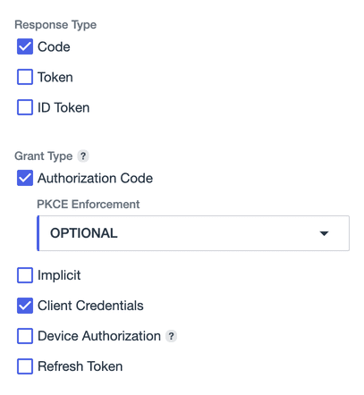
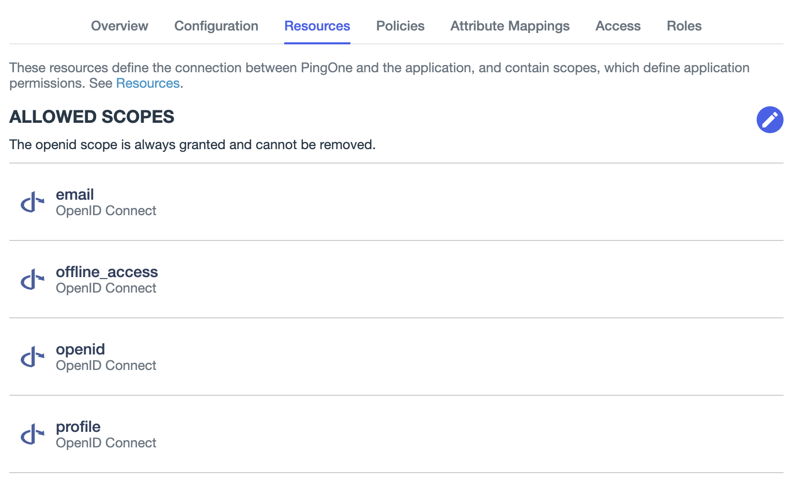

# Ping Identity OIDC Authentication Provider Setup

### Prerequisite: Configure Ping Identity Application

Set up the Ping Identity environment and application. Refer to the [Ping Identity Application Setup](./ping-identity-env-setup.md) documentation for instructions.

#### Edit Application Configuration

Navigate to the `Application Overview > Configuration Tab` and click the edit button.

- Check `Code` in `Response Type` and `Authorization Code` in `Grant Type`.



- Set Redirect URIs to `https://your-backstage.com/api/auth/oidc/handler/frame`.

Navigate to the `Application Overview > Resources Tab` and click the edit button.

- Add `email`, `offline_access` and `profile` to allowed scopes.



**Note:** the display name in the RHDH instance maps to `Formatted Name` in Ping Identity user profile. If this parameter is not set, it will default to the user entity ref.

- The `Formatted Name` can be set by navigating to `Directory` > `Users`, clicking on the target user then editing the user profile with the edit button.

### Configuration

The provider configuration can then be added to your app-config.yaml under the root auth configuration:

```yaml
auth:
  providers:
    oidc:
      development:
        metadataUrl: https://auth.pingone.ca/${PING_IDENTITY_ENV_ID}/as/.well-known/openid-configuration
        clientId: ${PING_IDENTITY_CLIENT_ID}
        clientSecret: ${PING_IDENTITY_CLIENT_SECRET}
        prompt: auto #optional
        signIn:
          resolvers:
            - resolver: oidcSubClaimMatchingPingIdentityUserId
```

The OIDC provider requires three mandatory configuration keys:

- `clientId`: Copy from `Client ID` under `Configuration` tab.
- `clientSecret`: Copy from `Client Secret` under `Configuration` tab.
- `metadataUrl`: Copy from `OIDC Discovery Endpoint` under `Configuration` tab in `URLs` drop down.
- `prompt` (optional): Recommended to use auto so the browser will request login to the IDP if the user has no active session.
- `additionalScopes` (optional): List of scopes for the App Registration, to be requested in addition to the required ones.
- `signIn.resolvers.resolver` (optional): `oidcSubClaimMatchingPingIdentityUserId` is a secure user resolver that matches the `sub` claim from OIDC to the Ping Identity user ID. 

#### Known Issues

In the resolved user profile, the profile picture is rendered properly when frontend and backend are run on separate ports (i.e. `3000` and `7007`) but not when both are on the same port (i.e. both on `7007`).
