# CI Steps and Processes for Testing

This document provides a comprehensive overview of our Continuous Integration (CI) testing processes. It explains when and how different test jobs are triggered, where to monitor them, and details about the environments hosting these tests, along with guidance on how to access them.

## GitHub Pull Requests

When a new Pull Request (PR) is opened at [backstage-showcase](https://github.com/janus-idp/backstage-showcase), tests can be triggered in two ways:

1. **Commenting `/ok-to-test`**: Only members of the janus-idp GitHub organization can mark the PR with this comment to validate it for testing.

2. **Triggering Tests Post-Validation**: After a janus-idp member has validated the PR, anyone can trigger tests using the following commands:
   - `/test` or `/test all`
   - `/retest`

These interactions are picked up by the OpenShift-CI service, which sets up a test environment on the **IBM Cloud**, specifically on the `rhdh-pr-os` OpenShift Container Platform (OCP) cluster. The configurations and steps for setting up this environment are defined in the `openshift-ci-tests.sh` script.

> **Note:** We do **not** have PR checks running on Azure Kubernetes Service (AKS); all PR checks are executed on IBM Cloud's `rhdh-pr-os` cluster.

Detailed steps on how the tests and reports are managed can be found in the `run_tests()` function within the `openshift-ci-tests.sh` script. Additionally, all the different `yarn` commands that trigger various [Playwright projects] are described in the `package.json` file.

When the test run is complete, the status will be reported under your PR checks.

> **Important:** The environment in which the PR tests are executed is shared and ephemeral. All PR tests queue for the same environment, which is destroyed and recreated for each PR. Test outputs (screenshots, recordings, walkthroughs, etc.) are stored for a retention period of **6 months** and can be accessed by checking the **Details -> Artifacts** of the test check on the PR.

### Retrying Tests

PR tests are not automatically retried beyond the individual test retries specified in the Playwright configuration (each test is retried up to 2 times on failure). However, you can manually retrigger the entire test suite by commenting:

- `/retest e2e-tests`
- `/test all`

This is useful if you believe a failure was due to a flake or external issue and want to rerun the tests without making any code changes.

### CI Job Definitions

#### Pull Request Test Job

- **Purpose:** Validate new PRs for code quality, functionality, and integration.
- **Trigger:** When a PR is opened and `/ok-to-test` is commented by a janus-idp member, or when `/test`, `/test all`, or `/retest` is issued after validation.
- **Environment:** Runs on the ephemeral `rhdh-pr-os` cluster on IBM Cloud.
- **Configurations:**
  - Tests are executed on both **RBAC** (Role-Based Access Control) and **non-RBAC** instances to ensure comprehensive coverage.
- **Steps:**
  1. **Detection:** OpenShift-CI detects the PR event.
  2. **Environment Setup:** The test environment is set up using the `openshift-ci-tests.sh` script.
  3. **Test Execution:**
     - **Running Tests:** Executes test suites using `yarn` commands specified in `package.json`.
     - **Retry Logic:** Individual tests are retried up to 2 times as specified in the Playwright configuration.
  4. **Artifact Collection:**
     - Collects test artifacts (logs, screenshots, recordings).
     - Stores artifacts in the designated `ARTIFACT_DIR` for a retention period of **6 months**.
  5. **Reporting:**
     - Reports status back to the PR checks.
     - Generates and uploads HTML reports.
- **Artifacts:** Test reports, logs, screenshots, accessible via PR details under **Artifacts**.
- **Notifications:** Status updates posted on the PR.
- **Manual Retriggering:**
  - Tests can be manually retriggered using the `/retest e2e-tests` or `/test all` commands in the PR comments.

### GitHub PRs Diagram

## Nightly Tests

Nightly tests are run to ensure the stability and reliability of our codebase over time. These tests are executed on different clusters to cover various environments, including both **RBAC** and **non-RBAC** instances.

- **AKS Nightly Tests:** Nightly tests for Azure Kubernetes Service (AKS) run on the `bsCluster`. We do not have AKS PR checks; the AKS environment is exclusively used for nightly runs.

- **IBM Cloud Tests:** All nightly tests for the `main`, `1.3`, and `1.2` branches run against the `rhdh-pr-os` OpenShift Container Platform (OCP) cluster on IBM Cloud.

### Additional Nightly Jobs for Main Branch

The nightly job for the `main` branch also runs against:

- **`rhdh-os-1`** (currently OCP 4.14).
- **`rhdh-os-2`** (currently OCP 4.15).

We regularly upgrade the clusters to ensure that `rhdh-pr-os` is always at the latest version we support. The team manages these upgrades to keep our test environments up-to-date with the newest supported OCP versions.

> **Note:** The output of the nightly runs, including test results and any relevant notifications, is posted on the Slack channel **`#rhdh-e2e-test-alerts`**. This allows the team to monitor test outcomes and promptly address any issues that arise.

### CI Job Definitions

#### Nightly Test Job

- **Purpose:** Ensure ongoing stability and detect regressions in different environments.
- **Trigger:** Scheduled to run every night.
- **Environments:**
  - **AKS Nightly Tests:** Runs on the `bsCluster`.
  - **IBM Cloud Nightly Tests:** Runs on the `rhdh-pr-os`, `rhdh-os-1`, and `rhdh-os-2` clusters.
- **Configurations:**
  - Tests are executed on both **RBAC** and **non-RBAC** instances to cover different security configurations.
- **Steps:**
  1. **Triggering:** Nightly job is triggered by the scheduler.
  2. **Environment Setup:** Uses the `openshift-ci-tests.sh` script for setting up the environment.
     - **Cluster Selection:** Chooses the appropriate cluster based on the job name.
     - **Resource Configuration:** Sets up namespaces and configures resources.
     - **Deployment:** Deploys the Red Hat Developer Hub (RHDH) instance and necessary services.
  3. **Test Execution:**
     - Runs full test suites using the `yarn` commands.
     - Tests are executed similarly to the PR tests but may include additional suites.
     - **Retry Logic:** Individual tests are retried up to 2 times as specified in the Playwright configuration.
  4. **Artifact Collection:**
     - Collects and aggregates results.
     - Stores artifacts for later review for a retention period of **6 months**.
  5. **Reporting:**
     - Posts outputs to Slack channel `#rhdh-e2e-test-alerts`.
     - Generates reports for team visibility.
- **Artifacts:** Comprehensive test reports, logs, screenshots.
- **Notifications:** Results posted on Slack.

### Nightly Test Diagram

## Supported Platforms and Testing Strategies

Our CI pipeline supports testing on multiple platforms to ensure compatibility and stability across different environments. Tests are executed on both **RBAC** and **non-RBAC** instances to ensure that our applications function correctly under different security configurations.

### Supported Platforms

- **Azure Kubernetes Service (AKS):**

  - **Cluster:** `bsCluster`
  - **Testing Strategy:** Nightly tests are executed to validate functionality on AKS, covering both RBAC and non-RBAC configurations.
  - **Reasoning:** AKS represents a significant portion of our user base; testing ensures compatibility and performance on Azure infrastructure.
  - **Notes:** No PR tests are conducted on AKS; it is exclusively used for nightly runs.

- **IBM Cloud OpenShift Clusters:**

  - **Clusters:**
    - **`rhdh-pr-os`** (latest supported OCP version)
    - **`rhdh-os-1`** (currently OCP 4.14)
    - **`rhdh-os-2`** (currently OCP 4.15)
  - **Testing Strategy:**
    - PR tests and nightly tests run on `rhdh-pr-os`, covering both RBAC and non-RBAC instances.
    - Additional nightly tests for the main branch run on `rhdh-os-1` and `rhdh-os-2` to validate against different OCP versions.
  - **Reasoning:** Testing across multiple OCP versions ensures that our applications remain compatible with different OpenShift environments used by our customers.
  - **Notes:** Clusters are regularly upgraded to the latest supported OCP versions.

## Configuration and Installation of Testing Environments

### Automation Processes

- **Scripts Used:**

  - **`openshift-ci-tests.sh`**: Automates the setup of the test environment, deployment of RHDH instances, and execution of tests.

- **Automated Steps:**
  - **Environment Setup:**
    - **PR Tests:** Ephemeral environments are automatically created and destroyed per test run to ensure a clean state for each test.
    - **Nightly Tests:** Use long-running clusters with automated updates to reflect production-like environments.
  - **Deployment:**
    - RHDH instances are deployed using automated scripts and Helm charts to ensure consistency and repeatability.
  - **Test Execution:**
    - Tests are executed using `yarn` scripts defined in `package.json`, orchestrated by the CI pipeline.

### Configuration Details

- **Clusters:**
  - Configured with necessary resources and permissions.
  - Running specific versions of OpenShift (OCP 4.14, 4.15, latest).
- **RHDH Instances:**
  - Deployed with predefined configurations suitable for testing.
  - Ensures consistency across test runs and environments.
- **Environment Variables and Secrets:**
  - Environment variables such as `AKS_NIGHTLY_CLUSTER_NAME` and secrets like GitHub credentials are stored securely in the **OpenShift-CI Vault**.
    - Located under **Pipeline** and **e2e-tests Secrets**.
  - These are securely accessed by the scripts during runtime through environment variables.
- **Secrets Management:**
  - All sensitive information is managed securely within the OpenShift-CI Vault.
  - Access is controlled and audited to maintain security compliance, following best practices and compliance standards.

### Maintenance Procedures

- **Upgrades:**
  - Clusters are upgraded to new versions as they become supported.
  - Upgrades are tested in staging environments before being applied to ensure they do not disrupt CI processes.
- **Monitoring:**
  - Continuous monitoring is in place for issues.
  - Logs and alerts are set up for proactive management and quick response to any anomalies.
- **Artifacts Retention Policy:**
  - All test results and artifacts are retained for a period of **6 months**.
  - This allows for historical analysis, auditing, and troubleshooting if necessary.
