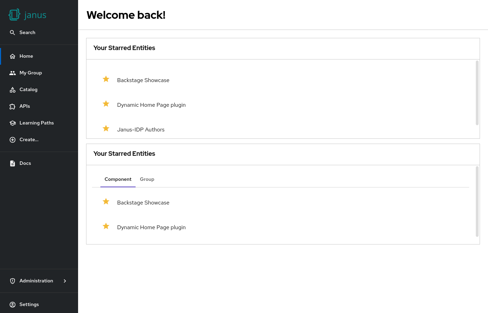

# Catalog starred entities

Shows entities the user has starred in the catalog.



## Examples

Starred entities and starred entities grouped by catalog `Kind`:

```yaml
dynamicPlugins:
  frontend:
    janus-idp.backstage-plugin-dynamic-home-page:
      mountPoints:
        - mountPoint: home.page/cards
          importName: CatalogStarredEntitiesCard
        - mountPoint: home.page/cards
          importName: CatalogStarredEntitiesCard
          config:
            props:
              groupByKind: true
```

## Available props

| Prop                       | Default                                                        | Description                                                      |
| -------------------------- | -------------------------------------------------------------- | ---------------------------------------------------------------- |
| `noStarredEntitiesMessage` | "Click the star beside an entity name to add it to this list!" | Message that is shown when no entities are starred               |
| `groupByKind`              | `false`                                                        | Option to enable a variant that group the elements by their kind |

## Contributions

The dynamic home page plugin reexports the [`HomePageStarredEntities`](https://github.com/backstage/backstage/tree/master/plugins/home/src/homePageComponents/StarredEntities) from the [home plugin](https://github.com/backstage/backstage/tree/master/plugins/home).
