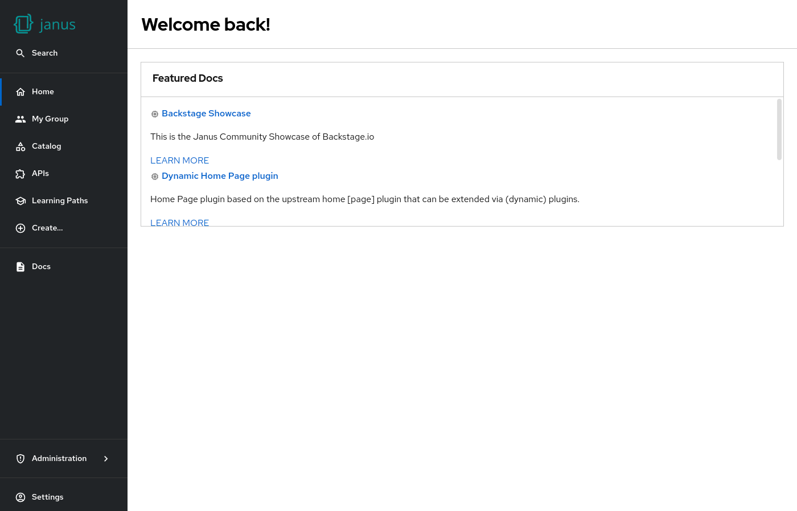

# Featured docs

Shows some techdocs.



## Example

```yaml
dynamicPlugins:
  frontend:
    janus-idp.backstage-plugin-dynamic-home-page:
      mountPoints:
        - mountPoint: home.page/cards
          importName: FeaturedDocsCard
```

## Available props

| Prop            | Default      | Description                          |
| --------------- | ------------ | ------------------------------------ |
| `filter`        | none         | Catalog filter options               |
| `responseLimit` | 10           | Number of entries that are displayed |
| `subLinkText`   | `LEARN MORE` | Link text to open the docs           |

## Contributions

The dynamic home page plugin reexports the [`FeaturedDocsCard`](https://github.com/backstage/backstage/tree/master/plugins/home/src/homePageComponents/FeaturedDocsCard) from the [home plugin](https://github.com/backstage/backstage/tree/master/plugins/home).
