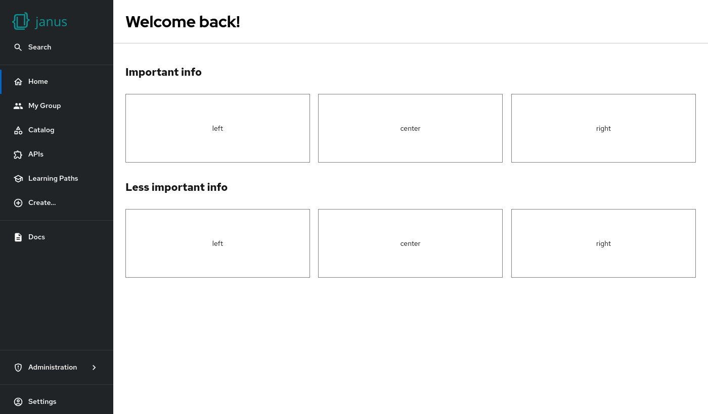

# Headline

Allow admins and customers to structure the home page content.



## Example

```yaml
dynamicPlugins:
  frontend:
    janus-idp.backstage-plugin-dynamic-home-page:
      mountPoints:
        - mountPoint: home.page/cards
          importName: Headline
          config:
            layouts:
              xl: { h: 1 }
              lg: { h: 1 }
              md: { h: 1 }
              sm: { h: 1 }
              xs: { h: 1 }
              xxs: { h: 1 }
            props:
              title: Important info
```

## Available props

| Prop    | Default | Description                                |
| ------- | ------- | ------------------------------------------ |
| `title` | none    | Title                                      |
| `align` | `left`  | Alignment like `left`, `center` or `right` |
