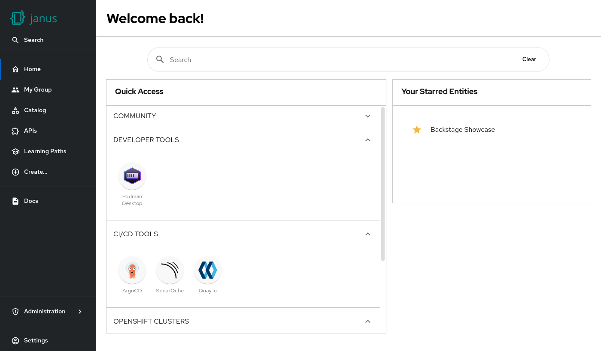

# Dynamic home page

The dynamic home page plugin is based on the upstream [home plugin](https://github.com/backstage/backstage/blob/master/plugins/home/README.md).

It allows admins to constomize the homepage in the `app-config`, and plugin authors to extend the home page with additional cards or content.

The default home page shows a Search input field, a "Quick Access" card, and a "Your Starred Entities" card by default.

Additional cards can automatically appear based on installed and enabled plugins.

