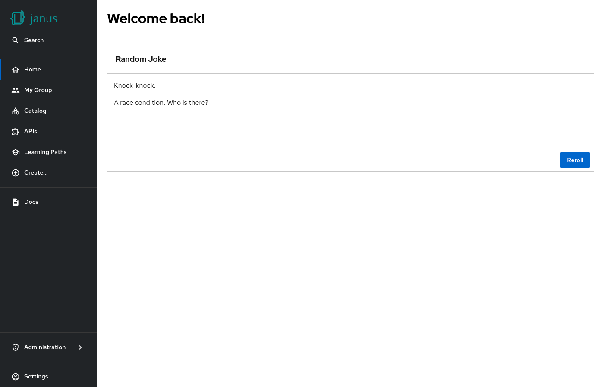

# Jokes

A card that shows a random joke loaded from [official-joke-api.appspot.com](https://official-joke-api.appspot.com/).

The sourcecode and jokes of the Joke API are available on [GitHub](https://github.com/15Dkatz/official_joke_api).



## Example

```yaml
dynamicPlugins:
  frontend:
    janus-idp.backstage-plugin-dynamic-home-page:
      mountPoints:
        - mountPoint: home.page/cards
          importName: JokeCard
```

## Contributions

The dynamic home page plugin reexports the [`HomePageRandomJoke`](https://github.com/backstage/backstage/tree/master/plugins/home/src/homePageComponents/RandomJoke) from the [home plugin](https://github.com/backstage/backstage/tree/master/plugins/home).
