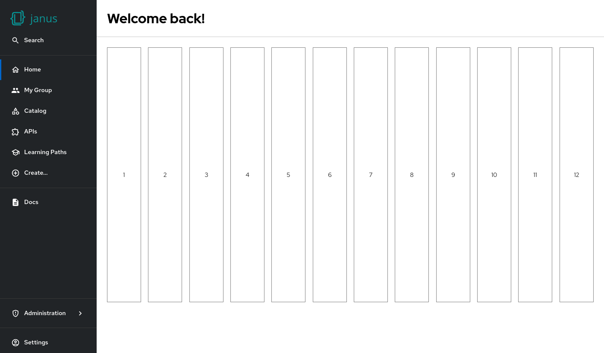
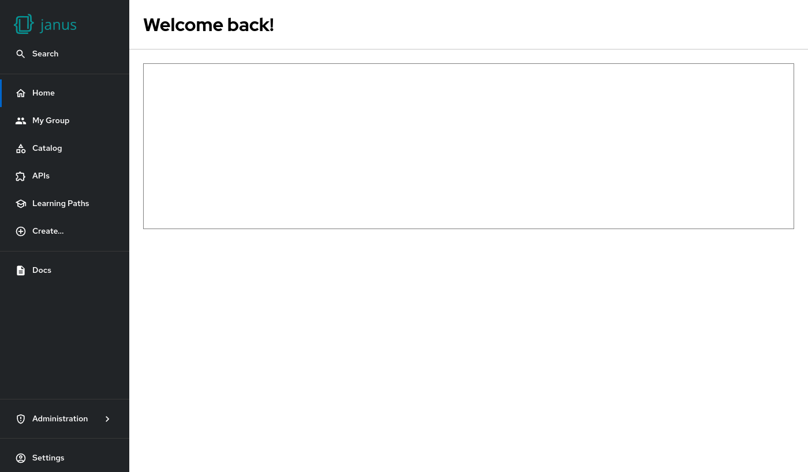
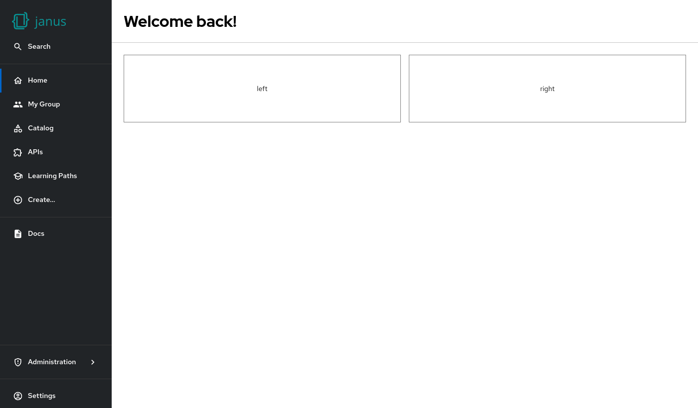

# Layout options

The cards and content of the home page is rendered in a **12-column-grid**.

All cards have a **fixed height** that can be changed by the admin.



## Default size

When no layout configuration is defined, the card will take the full width and uses four heights.

A single height unit takes 60 pixels and there is a gap between each column and row of 16 pixels.

So the default width takes 100% and the default height is 4*60 (row height) + 3*16 (gap) = 228 pixels.



```yaml
dynamicPlugins:
  frontend:
    janus-idp.backstage-plugin-dynamic-home-page:
      mountPoints:
        - mountPoint: home.page/cards
          importName: Placeholder
          config:
            props:
              showBorder: true
```

## Breakpoints

To have more space for the cards on smaller screensized, the home page supports breakpoints.

This breakpoints are:

| Breakpoint | Available content width (not the window or viewport width) |
| ---------- | ---------------------------------------------------------- |
| `xl`       | >= 1600                                                    |
| `lg`       | >= 1200                                                    |
| `md`       | >= 996                                                     |
| `sm`       | >= 768                                                     |
| `xs`       | >= 480                                                     |
| `xxs`      | >= 0                                                       |

## Layout definition

When a layout is defined it requires a layout for all breakpoints.

Each breakpoint have four optional parameters for the width (`w`), height (`h`) and the position (`x` and `y`).

The width is 12, the height is 4, and the position is x=0 and y=0 by default.

Cards are automatically shown among themselves, so that in the most cases it's not required to define `y`.

The following card will use the full space on smaller widows, and the half of the space on larger windows:


```yaml
dynamicPlugins:
  frontend:
    janus-idp.backstage-plugin-dynamic-home-page:
      mountPoints:
        - mountPoint: home.page/cards
          importName: Placeholder
          config:
            layouts:
              xl: { w: 6, h: 2 }
              lg: { w: 6, h: 2 }
              md: { w: 6, h: 2 }
              sm: { w: 12, h: 2 }
              xs: { w: 12, h: 2 }
              xxs: { w: 12, h: 2 }
            props:
              showBorder: true
              debugContent: a placeholder
```

<br/>

A second card will be shown below that card by default. To show cards side by side the card on the right must define a `x`-parameter like this:



```yaml
dynamicPlugins:
  frontend:
    janus-idp.backstage-plugin-dynamic-home-page:
      mountPoints:
        - mountPoint: home.page/cards
          importName: Placeholder
          config:
            layouts:
              xl: { w: 6, h: 2 }
              lg: { w: 6, h: 2 }
              md: { w: 6, h: 2 }
              sm: { w: 12, h: 2 }
              xs: { w: 12, h: 2 }
              xxs: { w: 12, h: 2 }
            props:
              showBorder: true
              debugContent: left
        - mountPoint: home.page/cards
          importName: Placeholder
          config:
            layouts:
              xl: { w: 6, h: 2, x: 6 }
              lg: { w: 6, h: 2, x: 6 }
              md: { w: 6, h: 2, x: 6 }
              sm: { w: 12, h: 2, x: 0 }
              xs: { w: 12, h: 2, x: 0 }
              xxs: { w: 12, h: 2, x: 0 }
            props:
              showBorder: true
              debugContent: right
```

<br/>

And this will work similar also for 3 columns of course:


```yaml
dynamicPlugins:
  frontend:
    janus-idp.backstage-plugin-dynamic-home-page:
      mountPoints:
        - mountPoint: home.page/cards
          importName: Placeholder
          config:
            layouts:
              xl: { w: 4, h: 2 }
              lg: { w: 4, h: 2 }
              md: { w: 4, h: 2 }
              sm: { w: 6, h: 2 }
              xs: { w: 12, h: 2 }
              xxs: { w: 12, h: 2 }
            props:
              showBorder: true
              debugContent: left
        - mountPoint: home.page/cards
          importName: Placeholder
          config:
            layouts:
              xl: { w: 4, h: 2, x: 4 }
              lg: { w: 4, h: 2, x: 4 }
              md: { w: 4, h: 2, x: 4 }
              sm: { w: 6, h: 2, x: 6 }
              xs: { w: 12, h: 2 }
              xxs: { w: 12, h: 2 }
            props:
              showBorder: true
              debugContent: center
        - mountPoint: home.page/cards
          importName: Placeholder
          config:
            layouts:
              xl: { w: 4, h: 2, x: 8 }
              lg: { w: 4, h: 2, x: 8 }
              md: { w: 4, h: 2, x: 8 }
              sm: { w: 6, h: 2 }
              xs: { w: 12, h: 2 }
              xxs: { w: 12, h: 2 }
            props:
              showBorder: true
              debugContent: right
```
