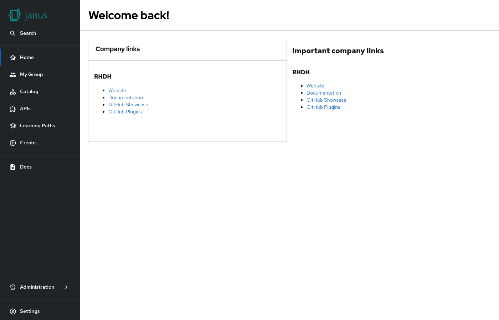

# Markdown

Markdown can be rendered in a `MarkdownCard` or as plain `Markdown` (without a border). Both components scroll as soon as the content is longer than the display area.

The title is optional for both components.



## Examples

```yaml
dynamicPlugins:
  frontend:
    janus-idp.backstage-plugin-dynamic-home-page:
      mountPoints:
        - mountPoint: home.page/cards
          importName: MarkdownCard
          config:
            layouts:
              xl: { w: 6, h: 4 }
              lg: { w: 6, h: 4 }
              md: { w: 6, h: 4 }
              sm: { w: 6, h: 4 }
              xs: { w: 6, h: 4 }
              xxs: { w: 6, h: 4 }
            props:
              title: Company links
              content: |
                ### RHDH

                * [Website](https://developers.redhat.com/rhdh/overview)
                * [Documentation](https://docs.redhat.com/en/documentation/red_hat_developer_hub/)
                * [GitHub Showcase](https://github.com/janus-idp/backstage-showcase)
                * [GitHub Plugins](https://github.com/janus-idp/backstage-plugins)
        - mountPoint: home.page/cards
          importName: Markdown
          config:
            layouts:
              xl: { w: 6, h: 4, x: 6 }
              lg: { w: 6, h: 4, x: 6 }
              md: { w: 6, h: 4, x: 6 }
              sm: { w: 6, h: 4, x: 6 }
              xs: { w: 6, h: 4, x: 6 }
              xxs: { w: 6, h: 4, x: 6 }
            props:
              title: Important company links
              content: |
                ### RHDH

                * [Website](https://developers.redhat.com/rhdh/overview)
                * [Documentation](https://docs.redhat.com/en/documentation/red_hat_developer_hub/)
                * [GitHub Showcase](https://github.com/janus-idp/backstage-showcase)
                * [GitHub Plugins](https://github.com/janus-idp/backstage-plugins)
```

## Available props

| Prop      | Default | Description  |
| --------- | ------- | ------------ |
| `title`   | none    | Card title   |
| `content` | none    | Card content |
