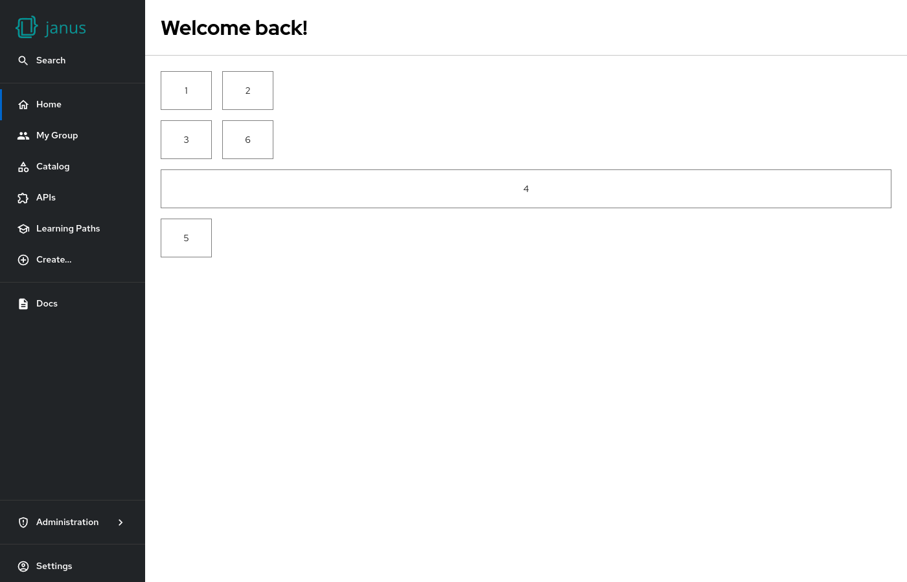

# Placeholder

The placeholder component could be used to test different layout options, and could also be used to add gaps between other components.



## Examples

```yaml
dynamicPlugins:
  frontend:
    janus-idp.backstage-plugin-dynamic-home-page:
      mountPoints:
        - mountPoint: home.page/cards
          importName: Placeholder
          config:
            layouts:
              xl: { w: 1, h: 1 }
              lg: { w: 1, h: 1 }
              md: { w: 1, h: 1 }
              sm: { w: 1, h: 1 }
              xs: { w: 1, h: 1 }
              xxs: { w: 1, h: 1 }
            props:
              showBorder: true
              debugContent: '1'
        - mountPoint: home.page/cards
          importName: Placeholder
          config:
            layouts:
              xl: { w: 1, h: 1, x: 1 }
              lg: { w: 1, h: 1, x: 1 }
              md: { w: 1, h: 1, x: 1 }
              sm: { w: 1, h: 1, x: 1 }
              xs: { w: 1, h: 1, x: 1 }
              xxs: { w: 1, h: 1, x: 1 }
            props:
              showBorder: true
              debugContent: '2'
        - mountPoint: home.page/cards
          importName: Placeholder
          config:
            layouts:
              xl: { w: 1, h: 1 }
              lg: { w: 1, h: 1 }
              md: { w: 1, h: 1 }
              sm: { w: 1, h: 1 }
              xs: { w: 1, h: 1 }
              xxs: { w: 1, h: 1 }
            props:
              showBorder: true
              debugContent: '3'

        - mountPoint: home.page/cards
          importName: Placeholder
          config:
            layouts:
              xl: { w: 12, h: 1 }
              lg: { w: 12, h: 1 }
              md: { w: 12, h: 1 }
              sm: { w: 12, h: 1 }
              xs: { w: 12, h: 1 }
              xxs: { w: 12, h: 1 }
            props:
              showBorder: true
              debugContent: '4'

        - mountPoint: home.page/cards
          importName: Placeholder
          config:
            layouts:
              xl: { w: 1, h: 1 }
              lg: { w: 1, h: 1 }
              md: { w: 1, h: 1 }
              sm: { w: 1, h: 1 }
              xs: { w: 1, h: 1 }
              xxs: { w: 1, h: 1 }
            props:
              showBorder: true
              debugContent: '5'
        - mountPoint: home.page/cards
          importName: Placeholder
          config:
            layouts:
              xl: { w: 1, h: 1, x: 1 }
              lg: { w: 1, h: 1, x: 1 }
              md: { w: 1, h: 1, x: 1 }
              sm: { w: 1, h: 1, x: 1 }
              xs: { w: 1, h: 1, x: 1 }
              xxs: { w: 1, h: 1, x: 1 }
            props:
              showBorder: true
              debugContent: '6'
```

## Available props

| Prop           | Default | Description                                            |
| -------------- | ------- | ------------------------------------------------------ |
| `showBorder`   | `false` | Option to show a gray border (for testing purpose)     |
| `debugContent` | `''`    | Option to show a text in the box (for testing purpose) |
