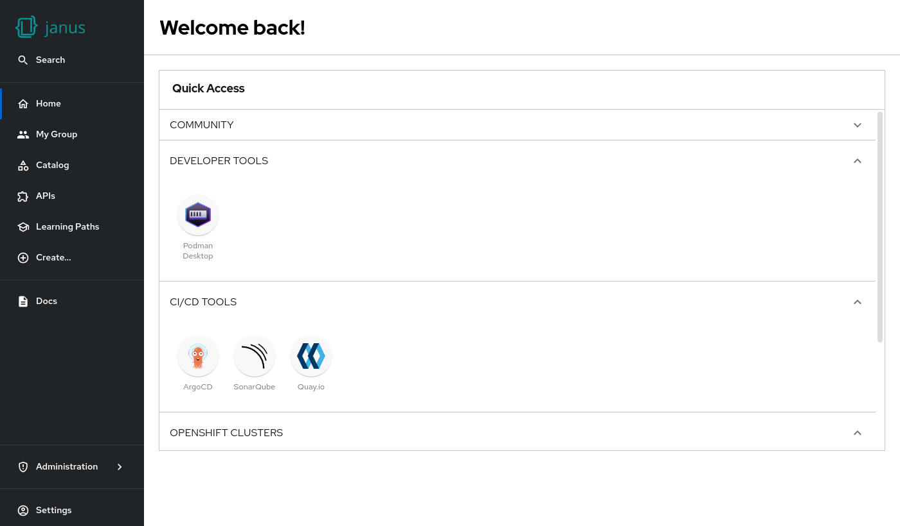

# Quick access card

Allow users to easily discover resource.



## Example

```yaml
dynamicPlugins:
  frontend:
    janus-idp.backstage-plugin-dynamic-home-page:
      mountPoints:
        - mountPoint: home.page/cards
          importName: QuickAccessCard
          config:
            layouts:
              xl: { h: 8 }
              lg: { h: 8 }
              md: { h: 8 }
              sm: { h: 8 }
              xs: { h: 8 }
              xxs: { h: 8 }
```

## Available props

| Prop    | Default        | Description                                         |
| ------- | -------------- | --------------------------------------------------- |
| `title` | `Quick Access` | Override the linked search path if needed.          |
| `path`  | none           | Override the search query parameter name if needed. |
