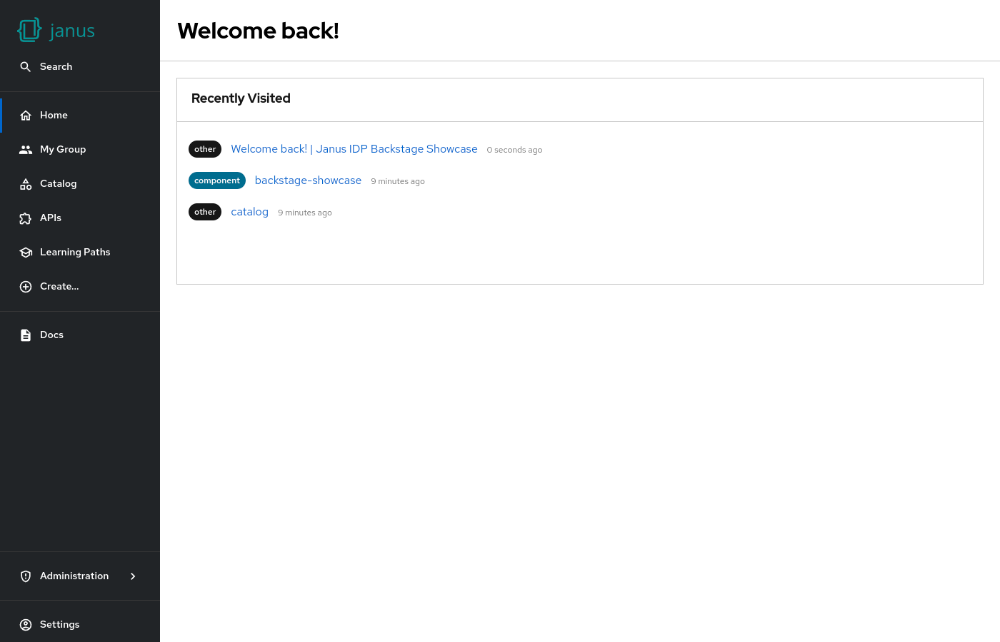

# Recently visited

> [!CAUTION]
> This feature is not part of RHDH 1.3, it is planned for RHDH 1.4.
> Follow [RHIDP-4235](https://issues.redhat.com/browse/RHIDP-4235) for more information.

Shows the recently visited pages (incl. catalog entities) the current user visited.



## Example

```yaml
dynamicPlugins:
  frontend:
    janus-idp.backstage-plugin-dynamic-home-page:
      mountPoints:
        - mountPoint: home.page/cards
          importName: RecentlyVisitedCard
```

## Contributions

The dynamic home page plugin reexports the [`HomePageRecentlyVisited`](https://github.com/backstage/backstage/tree/master/plugins/home/src/homePageComponents/VisitedByType) from the [home plugin](https://github.com/backstage/backstage/tree/master/plugins/home).
