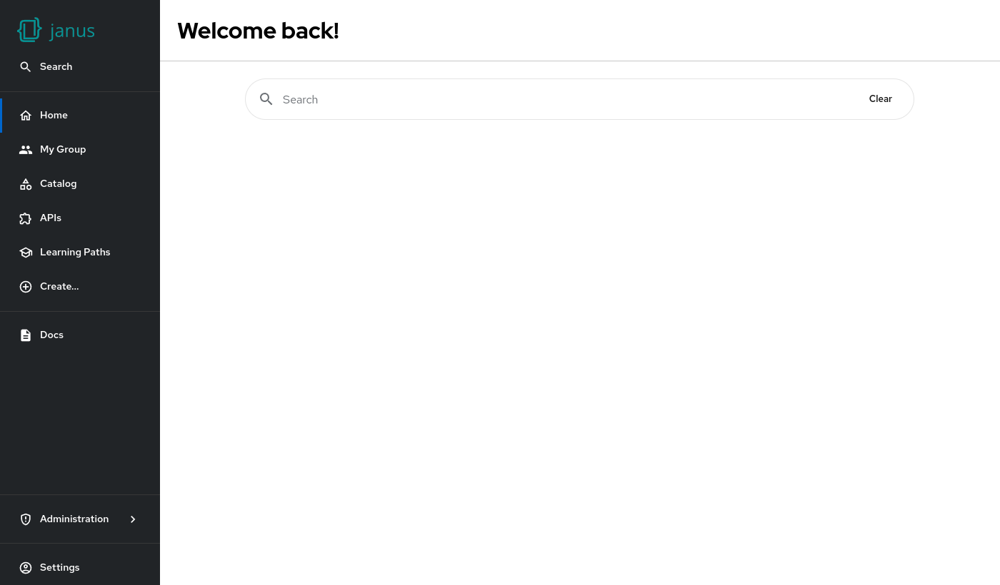

# Search bar

The search bar is a simple component that allows the user to start a search.



## Example

```yaml
dynamicPlugins:
  frontend:
    janus-idp.backstage-plugin-dynamic-home-page:
      mountPoints:
        - mountPoint: home.page/cards
          importName: SearchBar
          config:
            layouts:
              xl: { w: 10, h: 1, x: 1 }
              lg: { w: 10, h: 1, x: 1 }
              md: { w: 10, h: 1, x: 1 }
              sm: { w: 10, h: 1, x: 1 }
              xs: { w: 12, h: 1 }
              xxs: { w: 12, h: 1 }
```

## Available props

| Prop         | Default   | Description                                         |
| ------------ | --------- | --------------------------------------------------- |
| `path`       | `/search` | Override the linked search path if needed.          |
| `queryParam` | `query`   | Override the search query parameter name if needed. |
