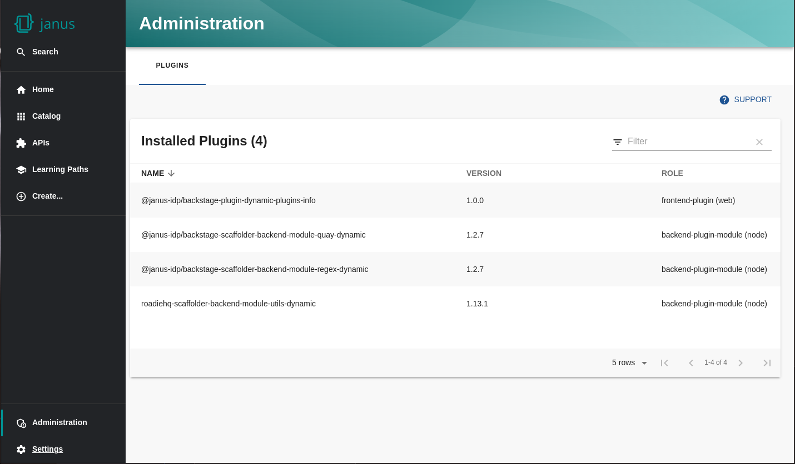

# Dynamic Plugins Info plugin for Backstage

The dynamic-plugins-info plugin is a frontend component for the [dynamic-plugins-info-backend](../dynamic-plugins-info-backend) plugin. It offers a simple table of plugins that are currently installed in Janus IDP (or Red Hat Developer Hub) that supports client-side sorting, filtering and pagination.

