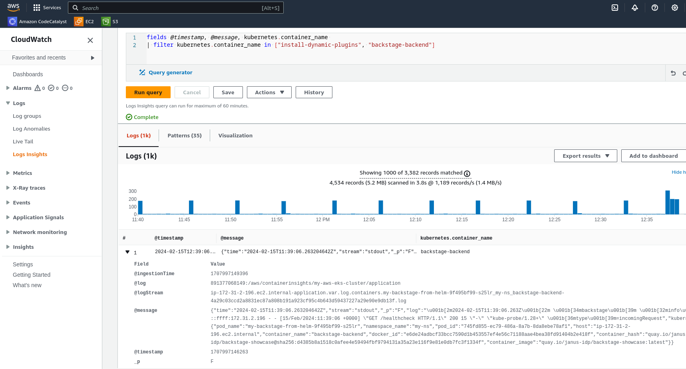
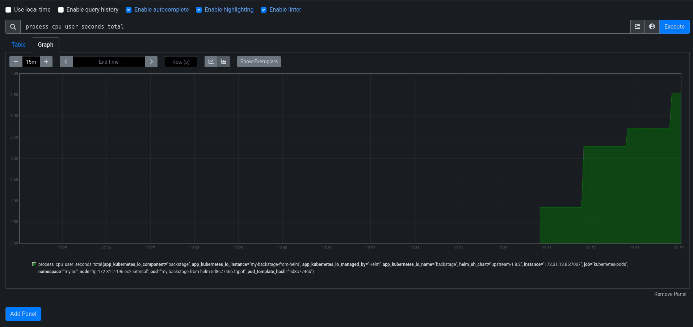
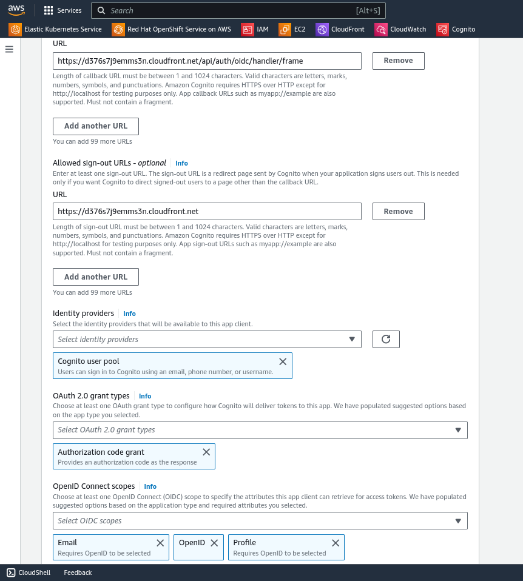
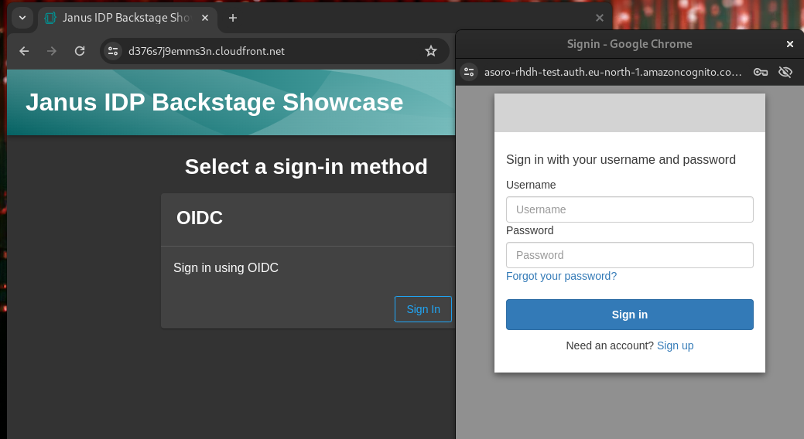
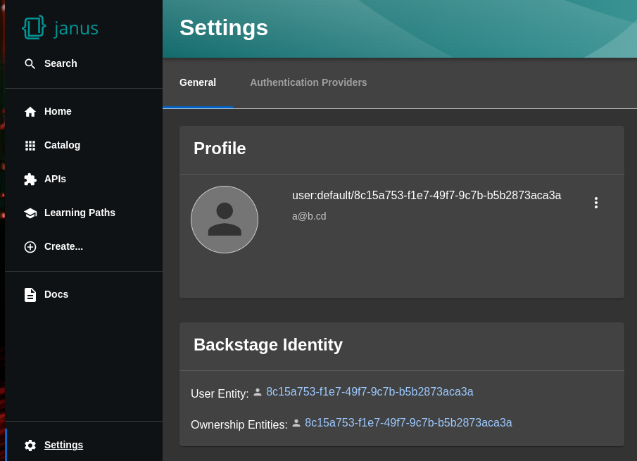

# Integrating with Amazon Web Services (AWS)

## Deploying in Elastic Kubernetes Services (EKS)

To deploy the Backstage Showcase Application in EKS, you need to:

- configure how the application will be exposed (ingress configuration),
- and configure volume permissions by setting an `fsGroup` field in the security context of the pods deployed.

To expose applications running in EKS, AWS recommends using the AWS Application Load Balancer (ALB). See [Application load balancing on Amawon EKS](https://docs.aws.amazon.com/eks/latest/userguide/alb-ingress.html). But you can also leverage any other Ingress Controller in your cluster, like [NGINX Ingress Controller](https://docs.nginx.com/nginx-ingress-controller/) or [Traefik](https://doc.traefik.io/traefik/providers/kubernetes-ingress/).

**NOTES**:

- If you do not know the desired group ID (from the container image), you can assign a random value to the corresponding `fsGroup` field. By setting `fsGroup` in the Pod Security Context, all processes of the containers are also made part of the supplementary group ID set in the field. The owner for volume mount location and any files created in that volume will be the group ID set in the field. However, be cautious with the use of `fsGroup`; changing the group ownership of an entire volume can cause pod startup delays for slow and/or large filesystems. Read these articles by [Snyk](https://snyk.io/blog/10-kubernetes-security-context-settings-you-should-understand/) and [Google Cloud](https://cloud.google.com/kubernetes-engine/docs/troubleshooting/troubleshooting-gke-storage#mounting_a_volume_stops_responding_due_to_the_fsgroup_setting) to learn more about it.

- Setting an HTTPS Listener with ALB requires a certificate with your custom domain. If you don't have any custom domain/certificate, you can define the HTTP Listener in ALB, and then create a CloudFront distribution using the ALB endpoint as the content origin. This way, it would be possible to access the Backstage application using the CloudFront domain name. See [Steps for creating a distribution](https://docs.aws.amazon.com/AmazonCloudFront/latest/DeveloperGuide/distribution-web-creating.html).

### Using Helm

See [Helm Chart installation](helm-chart.md) for more details.

You will need to set the following in your `values.yaml` file:

```yaml
global:
  # TODO: Adjust this value if you know the DNS name under which
  # your Showcase instance will be exposed.
  # If using ALB with dynamic load balancer DNS, you'll need to deploy first
  # (so as to get the ALB Ingress provisioned),
  # then change this value and redeploy.
  # Adjust if using a different Ingress Controller.
  host: <app_dns_name>
route:
  enabled: false # OpenShift Routes do not exist on vanilla Kubernetes
upstream:
  service:
    # NodePort is required for the ALB to route to the Service
    type: NodePort

  ingress:
    enabled: true # Use Kubernetes Ingress instead of OpenShift Route

    annotations:
      # TODO: alb because AWS recommends using ALB.
      # But adjust if using a different Ingress Controller
      # and remove the 'alb.*' annotations accordingly.
      kubernetes.io/ingress.class: alb

      # TODO: Add your subnets if needed
      # alb.ingress.kubernetes.io/subnets: subnet-xxx,subnet-yyy

      # Below annotation is to specify if the loadbalancer is "internal" or "internet-facing"
      alb.ingress.kubernetes.io/scheme: internet-facing

      # TODO: Using an ALB HTTPS Listener requires a certificate for your own domain. Fill in the ARN of your certificate, e.g.:
      # alb.ingress.kubernetes.io/certificate-arn: arn:aws:acm:us-west-2:xxxx:certificate/xxxxxx

      # TODO: The HTTPS listener below requires setting the certificate ARN above. Remove it if you plan to expose your instance differently, for example via a CloudFront distribution.
      alb.ingress.kubernetes.io/listen-ports: '[{"HTTP": 80}, {"HTTPS":443}]'

      # TODO: if needed, set HTTP to HTTPS redirects. Every HTTP listener configured will be redirected to below mentioned port over HTTPS.
      # alb.ingress.kubernetes.io/ssl-redirect: '443'

  backstage:
    podSecurityContext:
      fsGroup: 2000 # you can assign any random value as fsGroup
  postgresql:
    primary:
      podSecurityContext:
        enabled: true
        fsGroup: 3000 # you can assign any random value as fsGroup
  volumePermissions:
    enabled: true
```

**NOTES**:

- Setting the HTTPS Listener with ALB requires a certificate with your custom domain. If you don't have any custom domain/certificate, you can set the `alb.ingress.kubernetes.io/listen-ports` annotation to `[{"HTTP": 80}]`, and then create a CloudFront distribution using the ALB endpoint as the content origin. This way, it would be possible to access the application using the CloudFront domain name. See [Steps for creating a distribution](https://docs.aws.amazon.com/AmazonCloudFront/latest/DeveloperGuide/distribution-web-creating.html).
- Make sure to replace `<app_dns_name>` with the value of the Showcase application DNS name (e.g. a custom domain name known upfront, or an ALB DNS name, or a CloudFront DNS name like `d376s7j9emms3n.cloudfront.net` if you used CloudFront behind your ALB).
  If you are using ALB with a dynamic load balancer DNS, you'll need to deploy first (so as to get the ALB Ingress provisioned by AWS), then change the `global.host` value with the DNS name returned by AWS and redeploy.

### Using the Operator

#### Installing the Operator

See the [operator developer guide](https://github.com/janus-idp/operator/blob/main/docs/developer.md) for more details on how to deploy the operator.
In a nutshell:

- if you have the Operator Lifecycle Manager (OLM) installed in your cluster, you can run `make deploy-olm` to deploy the operator.
- otherwise, you can either run `make deploy` to deploy the operator right away, or run `make deployment-manifest` to generate a YAML file that you can adjust and apply against your cluster.

Since we need to configure volume permissions by setting an `fsGroup` field in the security context of the pods deployed by the operator, we will generate and manually update the deployment manifest.

- Clone the operator repo:

```sh
$ git clone --depth=1 https://github.com/janus-idp/operator.git backstage-operator \
  && cd backstage-operator
```

- Generate the deployment manifest with the command below. This will generate a file named `rhdh-operator-<VERSION>.yaml` that we will need to manually update.

```sh
$ make deployment-manifest
```

- Open the deployment manifest file with your favorite editor, and
  - locate the “db-statefulset.yaml” string and add the fsGroup to its `spec.template.spec.securityContext`, e.g.:

```yaml
  db-statefulset.yaml: |
    apiVersion: apps/v1
    kind: StatefulSet
--- TRUNCATED ---
    spec:
      --- TRUNCATED ---
      restartPolicy: Always
      securityContext:
        # You can assign any random value as fsGroup
        fsGroup: 2000
      serviceAccount: default
      serviceAccountName: default
--- TRUNCATED ---
```

- locate the “deployment.yaml” string and add the fsGroup to its spec, e.g.:

```yaml
  deployment.yaml: |
    apiVersion: apps/v1
    kind: Deployment
--- TRUNCATED ---
    spec:
      securityContext:
        # You can assign any random value as fsGroup
        fsGroup: 3000
      automountServiceAccountToken: false
--- TRUNCATED ---
```

- locate the “service.yaml” string and change the type to NodePort, e.g.:

```yaml
service.yaml: |
  apiVersion: v1
  kind: Service
  spec:
   # NodePort is required for the ALB to route to the Service
   type: NodePort
---
TRUNCATED ---
```

- Now apply the operator deployment manifest:

```sh
$ kubectl apply -f rhdh-operator-VERSION.yaml
```

- At this point, the operator will be created in the `backstage-system` namespace after some time. To check if it is running, you can run the following command and wait for the operator pod to be Running:

```sh
$ kubectl -n backstage-system get pods -w
```

#### Installing the Showcase application

Now that the operator is installed and running, we can create a Backstage instance in EKS.

- Create a Custom Resource file using the following template as content:

```yaml
apiVersion: rhdh.redhat.com/v1alpha1
kind: Backstage
metadata:
  # TODO: this the name of your showcase instance
  name: my-backstage
spec:
  application:
    route:
      enabled: false
```

- To expose and access the Backstage Instance, you will need to manually create an Ingress Resource. You can use the template below:

```yaml
apiVersion: networking.k8s.io/v1
kind: Ingress
metadata:
  # TODO: this the name of your showcase instance
  name: my-backstage
  annotations:
    # Below annotation is to specify if the loadbalancer is "internal" or "internet-facing"
    alb.ingress.kubernetes.io/scheme: internet-facing

    alb.ingress.kubernetes.io/target-type: ip

    # TODO: Using an ALB HTTPS Listener requires a certificate for your own domain. Fill in the ARN of your certificate, e.g.:
    # alb.ingress.kubernetes.io/certificate-arn: arn:aws:acm:us-west-2:xxxx:certificate/xxxxxx

    # TODO: The HTTPS listener below requires setting the certificate ARN above. Remove it if you plan to expose your instance differently, for example via a CloudFront distribution.
    alb.ingress.kubernetes.io/listen-ports: '[{"HTTP": 80}, {"HTTPS":443}]'

    # TODO: if needed, set HTTP to HTTPS redirects. Every HTTP listener configured will be redirected to below mentioned port over HTTPS.
    # alb.ingress.kubernetes.io/ssl-redirect: '443'

spec:
  # alb because we are using ALB.
  # But adjust if using a different Ingress Controller
  # and remove the 'alb.*' annotations accordingly.
  ingressClassName: alb
  rules:
    - http:
        paths:
          - path: /
            pathType: Prefix
            backend:
              service:
                # TODO: my-backstage is the name of your Backstage Custom Resource.
                # Adjust if you changed it!
                name: backstage-my-backstage
                port:
                  name: http-backend
```

**Notes**:

- Setting the HTTPS Listener with ALB requires a certificate with your custom domain. If you don't have any custom domain/certificate, you can set the `alb.ingress.kubernetes.io/listen-ports` annotation to `[{"HTTP": 80}]`, and then create a CloudFront distribution using the ALB endpoint as the content origin. This way, it would be possible to access the application using the CloudFront domain name. See [Steps for creating a distribution](https://docs.aws.amazon.com/AmazonCloudFront/latest/DeveloperGuide/distribution-web-creating.html).

- We now need to set the URL to the application into the configuration of the deployed Backstage application.

  - Create a ConfigMap named `app-config-backstage` storing the Showcase configuration using the following template:

```yaml
apiVersion: v1
kind: ConfigMap
metadata:
  name: app-config-backstage
data:
  'app-config-backstage.yaml': |
    app:
      baseUrl: https://<app_dns_name>
    backend:
      auth:
        keys:
          - secret: "${BACKEND_SECRET}"
      baseUrl: https://<app_dns_name>
      cors:
        origin: https://<app_dns_name>
```

Make sure to replace `<app_dns_name>` with the value of the Showcase application DNS name (e.g. a custom domain name known upfront, or an ALB DNS name, like `k8s-rhdhoper-myrhdh-f9ec8d3481-1192320380.eu-north-1.elb.amazonaws.com` from our output above, or a CloudFront DNS name like `d376s7j9emms3n.cloudfront.net` if you used CloudFront behind your ALB).
If you are using ALB with a dynamic load balancer DNS, you'll need to deploy first (so as to get the ALB Ingress provisioned by AWS), then change the `global.host` value with the DNS name returned by AWS and redeploy.

- Create a Secret named `secrets-backstage` and add a key named `BACKEND_SECRET` with a Base64-encoded string as value. Use a unique value for each Backstage instance.

```yaml
apiVersion: v1
kind: Secret
metadata:
  name: secrets-backstage
stringData:
  # TODO: See https://backstage.io/docs/auth/service-to-service-auth/#setup:
  # node -p 'require("crypto").randomBytes(24).toString("base64")'
  BACKEND_SECRET: 'R2FxRVNrcmwzYzhhN3l0V1VRcnQ3L1pLT09WaVhDNUEK' # notsecret
```

- Then update your Backstage Custom Resource created in the first step above:

```yaml
apiVersion: rhdh.redhat.com/v1alpha1
kind: Backstage
metadata:
  # TODO: this the name of your showcase instance
  name: my-backstage
spec:
  application:
    route:
      enabled: false
    appConfig:
      configMaps:
        - name: 'app-config-backstage'
    extraEnvs:
      secrets:
        - name: 'secrets-backstage'
```

## Logging with Amazon CloudWatch Logs

Please refer to [Logging](monitoring-and-logging.md#logging) for more details on how to adjust the logging level of the Backstage application.

Amazon recommends using CloudWatch Container Insights to capture logs and metrics for Amazon EKS. More details in [Logging for Amazon EKS](https://docs.aws.amazon.com/prescriptive-guidance/latest/implementing-logging-monitoring-cloudwatch/kubernetes-eks-logging.html).

To do so, you can install the Amazon CloudWatch Observability EKS add-on in your cluster. More details in [this tutorial](https://docs.aws.amazon.com/AmazonCloudWatch/latest/monitoring/Container-Insights-setup-EKS-addon.html).

After you have Container Insights set up, you can view the container logs using the Logs Insights or Live Tail views. The log group in which all containers logs are gathered is named as follows by CloudWatch: `/aws/containerinsights/<ClusterName>/application`.
The following is an example query to get the logs coming from the Backstage instance:

```
fields @timestamp, @message, kubernetes.container_name
| filter kubernetes.container_name in ["install-dynamic-plugins", "backstage-backend"]
```



## Monitoring with [Amazon Prometheus](https://aws.amazon.com/prometheus/)

As depicted in [Setting up Metrics Monitoring and Logging for Backstage Showcase](monitoring-and-logging.md#setting-up-metrics-monitoring-and-logging-for-backstage-showcase), the Backstage Showcase exposes Prometheus metrics about the running application.
See [this tutorial](https://docs.aws.amazon.com/eks/latest/userguide/prometheus.html) on how to turn on or deploy Prometheus for EKS clusters.
Additionally, you will need to [create an Amazon Managed Service for Prometheus workspace](https://docs.aws.amazon.com/prometheus/latest/userguide/AMP-onboard-create-workspace.html), and [set up the ingestion](https://docs.aws.amazon.com/prometheus/latest/userguide/AMP-onboard-ingest-metrics.html) of the Backstage Prometheus metrics.

Once this is done, we can configure the metrics scraping to scrap from pods based on pod annotations.

### Configuration

The steps to add the Prometheus annotations for Helm and Operator-backed deployments are the same depicted in [Enabling Metrics Monitoring](monitoring-and-logging.md#enabling-metrics-monitoring-on-azure-kubernetes-service-aks).

### Verification

As described [here](https://docs.aws.amazon.com/eks/latest/userguide/prometheus.html#deploy-prometheus), one way to verify if scraping works correctly is by:

1. using `kubectl` to port-forward the Prometheus console to your local machine:

```bash
$ kubectl --namespace=prometheus port-forward deploy/prometheus-server 9090
```

2. pointing your web browser to http://localhost:9090 to view the Prometheus,
3. and monitoring any relevant metrics like `process_cpu_user_seconds_total`:



## Using AWS Cognito as Authentication Provider

Amazon Cognito is the underlying AWS service recommended for adding an authentication layer to web applications like Backstage. Your Backstage users can sign in either directly through a user pool, or federate through a third-party identity provider.

Amazon Cognito is not part of the core authentication providers provided by Backstage, but we can use it via the generic OpenID Connect (OIDC) provider.

**Prerequisites**

- Make sure you have a User Pool (or create a new one). See [Amazon Cognito user pools](https://docs.aws.amazon.com/cognito/latest/developerguide/cognito-user-identity-pools.html?icmpid=docs_cognito_console_help_panel).
  - Keep track of the AWS region where the user pool is created
  - Keep track of the user pool ID
- In your user pool, create an App Client for integrating the hosted UI. See [Setting up the hosted UI with the Amazon Cognito console](https://docs.aws.amazon.com/cognito/latest/developerguide/cognito-user-pools-app-integration.html#cognito-user-pools-create-an-app-integration).
  - Under **Allowed callback URL(s)**, add `https://<app_dns>/api/auth/oidc/handler/frame`
    - Make sure to replace `<app_dns>` with the URL to your Showcase application, e.g.: `my.backstage.example.com`
  - Under **Allowed sign-out URL(s)**, add `https://<app_dns>`
    - Make sure to replace `<app_dns>` with the URL to your Showcase application, e.g.: `my.backstage.example.com`
  - Under **OAuth 2.0 grant types**, select **Authorization code grant** to return an authorization code
  - Under **OpenID Connect scopes**, select at least the following scopes:
    - OpenID
    - Profile
    - Email



### Configuring the application

#### Helm deployment

1. Edit or create your custom `app-config-backstage` ConfigMap:

```yaml
apiVersion: v1
kind: ConfigMap
metadata:
  name: app-config-backstage
data:
  'app-config-backstage.yaml': |

    signInPage: oidc
    auth:
      # Production to disable guest user login
      environment: production
      # Providing an auth.session.secret is needed because the oidc provider requires session support.
      session:
        secret: ${AUTH_SESSION_SECRET}
      providers:
        oidc:
          production:
            # See https://github.com/backstage/backstage/blob/master/plugins/auth-backend-module-oidc-provider/config.d.ts
            clientId: ${AWS_COGNITO_APP_CLIENT_ID}
            clientSecret: ${AWS_COGNITO_APP_CLIENT_SECRET}
            metadataUrl: ${AWS_COGNITO_APP_METADATA_URL}
            callbackUrl: ${AWS_COGNITO_APP_CALLBACK_URL}
            # Minimal set of scopes needed. Feel free to add more if needed.
            scope: 'openid profile email'

            # Note that by default, this provider will use the 'none' prompt which assumes that your are already logged on in the IDP.
            # You should set prompt to:
            # - auto: will let the IDP decide if you need to log on or if you can skip login when you have an active SSO session
            # - login: will force the IDP to always present a login form to the user
            prompt: auto
```

2. Edit or create your custom `secrets-backstage` Secret with the following template. Make sure to replace the values accordingly.

```yaml
apiVersion: v1
kind: Secret
metadata:
  name: secrets-backstage
stringData:
  # --- Truncated ---
  # TODO: Change auth session secret.
  AUTH_SESSION_SECRET: 'my super auth session secret - change me!!!'

  # TODO: user pool app client ID
  AWS_COGNITO_APP_CLIENT_ID: 'my-aws-cognito-app-client-id'

  # TODO: user pool app client Secret
  AWS_COGNITO_APP_CLIENT_SECRET: 'my-aws-cognito-app-client-secret'

  # TODO: Replace region and user pool ID
  AWS_COGNITO_APP_METADATA_URL: 'https://cognito-idp.[region].amazonaws.com/[userPoolId]/.well-known/openid-configuration'

  # TODO: Replace <app_dns>
  AWS_COGNITO_APP_CALLBACK_URL: 'https://[app_dns]/api/auth/oidc/handler/frame'
```

3. Reference both the ConfigMap and Secret resources in your `values.yaml` file by setting the `upstream.backstage.extraAppConfig` and `upstream.backstage.extraEnvVarsSecrets` fields, like so:

```yaml
# --- Truncated ---
upstream:
  backstage:
    podSecurityContext:
      fsGroup: 2000
    extraAppConfig:
      - filename: app-config-backstage.yaml
         configMapRef: app-config-backstage
    extraEnvVarsSecrets:
      - secrets-backstage
# --- Truncated ---
```

4. Upgrade your Helm release.

#### Operator-backed deployment

1. Add the following to your `app-config-backstage` ConfigMap:

```yaml
apiVersion: v1
kind: ConfigMap
metadata:
  name: app-config-backstage
data:
  'app-config-backstage.yaml': |
    # --- Truncated ---

    signInPage: oidc
    auth:
      # Production to disable guest user login
      environment: production
      # Providing an auth.session.secret is needed because the oidc provider requires session support.
      session:
        secret: ${AUTH_SESSION_SECRET}
      providers:
        oidc:
          production:
            # See https://github.com/backstage/backstage/blob/master/plugins/auth-backend-module-oidc-provider/config.d.ts
            clientId: ${AWS_COGNITO_APP_CLIENT_ID}
            clientSecret: ${AWS_COGNITO_APP_CLIENT_SECRET}
            metadataUrl: ${AWS_COGNITO_APP_METADATA_URL}
            callbackUrl: ${AWS_COGNITO_APP_CALLBACK_URL}
            # Minimal set of scopes needed. Feel free to add more if needed.
            scope: 'openid profile email'

            # Note that by default, this provider will use the 'none' prompt which assumes that your are already logged on in the IDP.
            # You should set prompt to:
            # - auto: will let the IDP decide if you need to log on or if you can skip login when you have an active SSO session
            # - login: will force the IDP to always present a login form to the user
            prompt: auto
```

2. Add the following to your `secrets-backstage` Secret. Replace the values accordingly.

```yaml
apiVersion: v1
kind: Secret
metadata:
  name: secrets-backstage
stringData:
  # --- Truncated ---

  # TODO: Change auth session secret.
  AUTH_SESSION_SECRET: 'my super auth session secret - change me!!!'

  # TODO: user pool app client ID
  AWS_COGNITO_APP_CLIENT_ID: 'my-aws-cognito-app-client-id'

  # TODO: user pool app client Secret
  AWS_COGNITO_APP_CLIENT_SECRET: 'my-aws-cognito-app-client-secret'

  # TODO: Replace region and user pool ID
  AWS_COGNITO_APP_METADATA_URL: 'https://cognito-idp.[region].amazonaws.com/[userPoolId]/.well-known/openid-configuration'

  # TODO: Replace <app_dns>
  AWS_COGNITO_APP_CALLBACK_URL: 'https://[app_dns]/api/auth/oidc/handler/frame'
```

3. Make sure your Custom Resource references both the `app-config-backstage` ConfigMap and `secrets-backstage` Secret, like so:

```yaml
apiVersion: rhdh.redhat.com/v1alpha1
kind: Backstage
metadata:
  # TODO: this the name of your Showcase instance
  name: my-backstage
spec:
  application:
    # --- Truncated ---
    appConfig:
      configMaps:
        - name: 'app-config-backstage'
    extraEnvs:
      secrets:
        - name: 'secrets-backstage'
```

4. If you already have an running instance of Backstage backed by the Custom Resource above and didn't edit the Custom Resource, please manually delete the Backstage Deployment to have it recreated by the operator. Run the following command (replace `<CR_NAME>` with the name of your Custom Resource):

```sh
$ kubectl delete deployment -l app.kubernetes.io/instance=<CR_NAME>
```

### Verification

Navigate to your Showcase web app URL and you should be able to sign in using OIDC, which will prompt you to authenticate through the configured AWS Cognito user pool.



Once logged in, click on **Settings** to confirm the user details:


