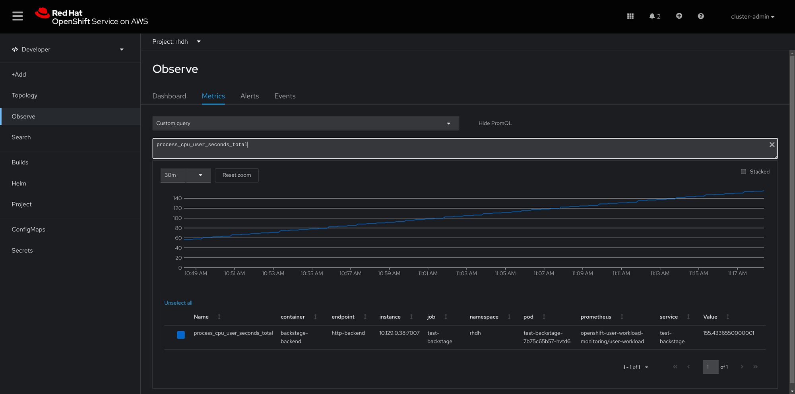

The Backstage Showcase provides a `/metrics` endpoint that provides Prometheus metrics about your backstage application. This endpoint can be used to monitor your backstage instance using Prometheus and Grafana.

When deploying Backstage Showcase onto a kubernetes cluster with the [Janus Helm chart](https://github.com/janus-idp/helm-backstage), monitoring and logging for your Janus instance can be configured using the following steps.

## Prerequisites

- Kubernetes 1.19+
- Helm 3.2.0+
- PV provisioner support in the underlying infrastructure
- The [Janus Helm chart repositories](https://github.com/janus-idp/helm-backstage#installing-from-the-chart-repository) have been added

## Metrics Monitoring

### Enabling Metrics Monitoring on Openshift

To enable metrics on Openshift, you will need to modify the `values.yaml` of the [Janus Helm chart](https://github.com/janus-idp/helm-backstage/blob/main/charts/backstage/values.yaml)

To obtain the `values.yaml`, you can run the following command:

```bash
helm show values janus-idp/backstage > values.yaml
```

Then, you will need to modify the `values.yaml` to enable metrics monitoring by adding the following configurations:

```yaml title="values.yaml"
upstream:
  # Other Configurations Above
  metrics:
    serviceMonitor:
      enabled: true
      path: /metrics
```

Then you can deploy the Janus Helm chart with the modified `values.yaml`:

```bash
helm upgrade -i <release_name> janus-idp/backstage -f values.yaml
```

This will create a `ServiceMonitor` resource in your Openshift cluster that will be used by Prometheus to scrape metrics from your Backstage instance. For the metrics to be ingested by the built-in Prometheus instances in Openshift, please ensure you enabled [monitoring for user-defined projects](https://docs.openshift.com/container-platform/latest/monitoring/enabling-monitoring-for-user-defined-projects.html)

You can then verify metrics are being captured by navigating to the Openshift Console. Go to `Developer` Mode, change to the namespace the showcase is deployed on, selecting `Observe` and navigating to the `Metrics` tab. Here you can create PromQL queries to query the metrics being captured by Prometheus.


### Enabling Metrics Monitoring on Azure Kubernetes Service (AKS)

To enable metrics monitoring for Backstage Showcase on Azure Kubernetes Service (AKS), you can use the [Azure Monitor managed service for Prometheus](https://learn.microsoft.com/en-us/azure/azure-monitor/essentials/prometheus-metrics-overview). The AKS cluster will need to have an associated [Azure Monitor workspace](https://learn.microsoft.com/en-us/azure/azure-monitor/containers/prometheus-metrics-enable?tabs=azure-portal).

One method is to configure the metrics scraping of your AKS cluster using the [Azure Monitor _metrics_ add-on](https://learn.microsoft.com/en-us/azure/azure-monitor/containers/prometheus-metrics-scrape-configuration).

The other method is to configure the Azure Monitor _monitoring_ add-on which also allows you to [send Prometheus metrics to the Log Analytics workspace](https://learn.microsoft.com/en-us/azure/azure-monitor/containers/container-insights-prometheus-logs). These metrics can then be queried using [Log Analytics queries](https://learn.microsoft.com/en-us/azure/azure-monitor/containers/container-insights-log-query#prometheus-metrics) as well as be visible in a Grafana instance.

In both methods, we can configure the metrics scraping to scrap from pods based on pod Annotations. To add annotations to the backstage pod, add the following to the Janus Helm chart `values.yaml`:

```yaml title="values.yaml"
upstream:
  backstage:
    # Other configurations above
    podAnnotations:
      # Other annotations above
      prometheus.io/scrape: 'true'
      prometheus.io/path: '/metrics'
      prometheus.io/port: '7007'
      prometheus.io/scheme: 'http'
```

#### Metrics Add-on

For the _metrics_ add-on, we can modify the [`ama-metrics-settings-configmap`](https://github.com/Azure/prometheus-collector/blob/main/otelcollector/configmaps/ama-metrics-settings-configmap.yaml) Config Map and enable pod annotations based scraping for the namespace your showcase instance is in. In the [example Config Map](./configuration_files/ama-metrics-settings-configmap.yaml), change the regex for the `podannotationnamespaceregex` option to match the namespaces you want to scrape from. For more information on how to configure this refer to the [official Azure docs](https://learn.microsoft.com/en-us/azure/azure-monitor/containers/prometheus-metrics-scrape-configuration#customize-metrics-collected-by-default-targets).

Alternatively, we will can instead add/modify the `ama-metrics-prometheus-config` Config Map in the `kube-system` namespace of the AKS cluster to configure custom scrape jobs. In the [example Config Map](./configuration_files/ama-metrics-prometheus-config.yaml), please replace the values of namespace with the namespace you the backstage instance into. For more information on how to configure this refer to the [official Azure docs](https://learn.microsoft.com/en-us/azure/azure-monitor/containers/prometheus-metrics-scrape-configuration#configure-custom-prometheus-scrape-jobs).

To view the metrics, you can create a Grafana instance, [connect it to the Azure Monitor workspace](https://docs.microsoft.com/en-us/azure/azure-monitor/visualize/tutorial-logs-dashboards-with-grafana#connect-grafana-to-azure-monitor) and view the metrics using PromQL queries.

#### Monitoring Add-on

For the _monitoring_ add-on, we will need to add the a modified instance of this [Config Map](https://raw.githubusercontent.com/microsoft/Docker-Provider/ci_prod/kubernetes/container-azm-ms-agentconfig.yaml) to the `kube-system` namespace of the AKS cluster. In the [example Config Map](./configuration_files/container-azm-ms-agentconfig.yaml), please replace the values of namespace with the namespace you deployed the backstage instance into. For more information refer to the [official Azure docs](https://learn.microsoft.com/en-us/azure/azure-monitor/containers/container-insights-prometheus-logs?tabs=cluster-wide).

To view the metrics, you can create a Grafana instance, [connect it to the Azure Monitor workspace](https://docs.microsoft.com/en-us/azure/azure-monitor/visualize/tutorial-logs-dashboards-with-grafana#connect-grafana-to-azure-monitor) and view the metrics using PromQL queries.

Alternatively, you can use [Log Analytics](https://learn.microsoft.com/en-us/azure/azure-monitor/containers/container-insights-log-query#prometheus-metrics) to query the metrics using KQL. The following is an example query to get a custom metric for the Backstage instance:

```kql
let custom_metrics = "custom-metric-name";
InsightsMetrics
| where Namespace contains "prometheus"
| where Name == custom_metrics
| extend tags = parse_json(Tags)
| where tostring(tags['app.kubernetes.io/component']) == "backstage"
```

## Logging

Logging in backstage showcase is conducted using the [winston](https://github.com/winstonjs/winston) library. By default, logs of level `debug` are not logged. To enable debug logs, you will need to set the environment variable `LOG_LEVEL` to `debug` in your deployment in the helm chart's `values.yaml` as follows:

```yaml title="values.yaml"
upstream:
  backstage:
    # Other configurations above
    extraEnvVars:
      - name: LOG_LEVEL
        value: debug
```

### Openshift Logging Integration

[Openshift Logging](https://access.redhat.com/documentation/en-us/openshift_container_platform/4.13/html/logging/index) can be used to monitor Backstage logs. The only requirement is to correctly filter logs in Kibana. A possible filter is using the field `kubernetes.container_name` with operator `is` and value `backstage-backend`.

### Logging with Azure Monitor Container Insights

[Azure Monitor Container Insights](https://learn.microsoft.com/en-us/azure/azure-monitor/containers/container-insights-log-query#container-logs) can be used to query logs from your Backstage instance. The AKS cluster must have Container Insights configured with container logs turned on. You can then query logs from your Backstage instance by querying from the `ContainerLogV2` table:

```kql
ContainerLogV2
| where ContainerName == "backstage-backend"
| project TimeGenerated, LogMessage
```
