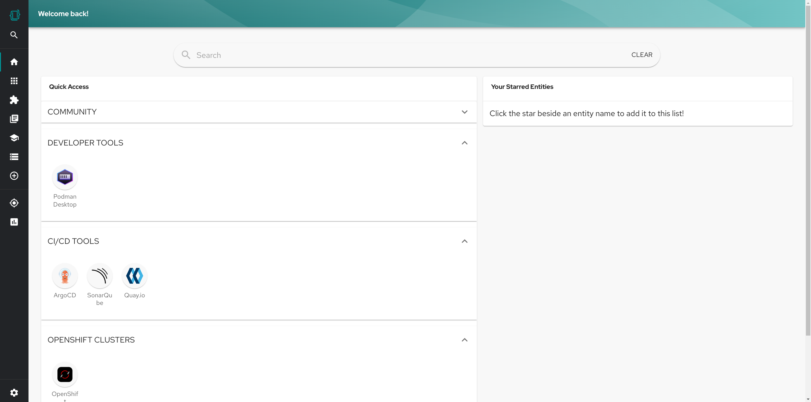
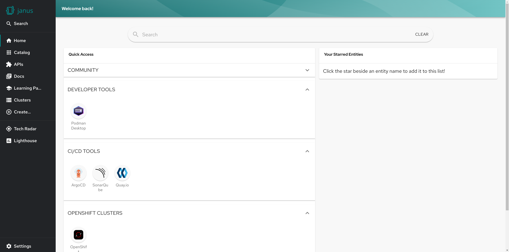
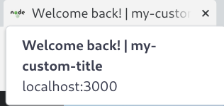
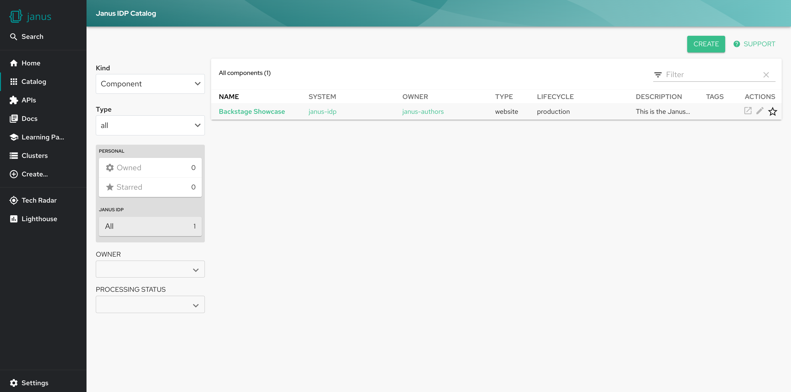
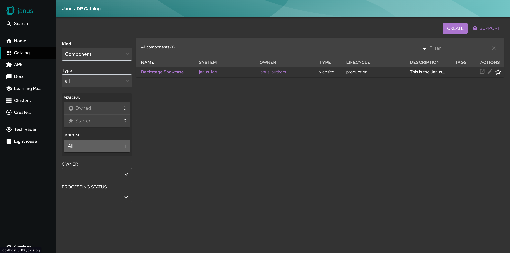
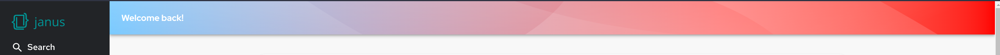
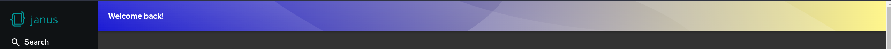
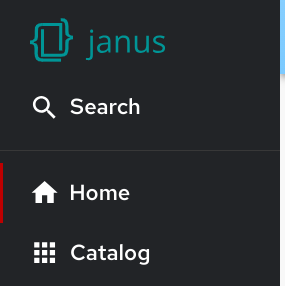
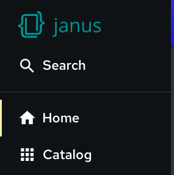

To customize the look of your showcase instance, you can edit the `app-config.yaml` file in the root of this repository. The customizations used to configure the app are loaded by the backstage app at startup, with certain values being queried by the app at runtime.

## Changing the Sidebar Logo

The sidebar uses two logos - one for the expanded sidebar and one for the collapsed sidebar.

- To customize the logo for the expanded sidebar, provide a Base64 encoded image of your logo in the `app.branding.fullLogo` field of the `app-config.yaml`.
- Similarly, to customize the logo for the collapsed sidebar, provide a Base64 encoded image of your logo in the `app.branding.iconLogo` field of the `app-config.yaml`:

```yaml title="app-config.yaml"
app:
  branding:
    fullLogo: ${BASE64_EMBEDDED_FULL_LOGO} # SVG Example: data:image/svg+xml;base64,PD94...
    iconLogo: ${BASE64_EMBEDDED_ICON_LOGO} # PNG Example: data:image/png;base64,iVBO...
```




## Changing the favicon and tab title

Currently, the favicon customization utilizes the same Base64 encoded image as the icon logo provided via `app.branding.iconLogo` in the `app-config.yaml`
Currently the favicon is only loaded once at startup, so if any changes need to be made to the favicon, the app will need to be restarted.

```yaml title="app-config.yaml"
app:
  branding:
    iconLogo: ${BASE64_EMBEDDED_ICON_LOGO}
```

To customize the tab title, provide a string value to the `app.title` field in the `app-config.yaml`:

```yaml title="app-config.yaml"
app:
  title: my-custom-title
```

You should then see the title of the tab in the form of `<page title> | my-custom-title`



## Customizing the your showcase colors

For all the color related customizations, the supported color formats are:

- Hexadecimal (`#nnn` or `#nnnnnn`)
- [hsl()](https://developer.mozilla.org/en-US/docs/Web/CSS/color_value/hsl) and [hsla()](https://developer.mozilla.org/en-US/docs/Web/CSS/color_value/hsl#legacy_syntax_hsla)
- [rgb()](https://developer.mozilla.org/en-US/docs/Web/CSS/color_value/rgb) and [rgba()](https://developer.mozilla.org/en-US/docs/Web/CSS/color_value/rgb#**legacy_syntax_rgba)
- [color()](https://developer.mozilla.org/en-US/docs/Web/CSS/color_value/color)

Currently, color customization between light mode and dark mode are separate and can be configured in their corresponding `app.branding.theme.[light or dark]` fields in the `app-config.yaml` file.

### Customizing the primary colors

To customize the color of links and buttons, provide your color in a [supported format](#customizing-the-your-showcase-colors) to the `app.branding.theme.[light or dark].primaryColor` field of the `app-config.yaml` file:

```yaml title="app-config.yaml"
app:
  branding:
    theme:
      light:
        primaryColor: '#38be8b'
      dark:
        primaryColor: '#ab75cf'
```




### Customizing the header banner colors

The header banner is a comprised of a pattern of two colors. It is possible to provide different customizations depending on whether the app is in light mode or dark mode. To customize the header banner colors, provide your colors in a [supported format](#customizing-the-your-showcase-colors) to the `app.branding.theme.[light or dark].headerColor[1 or 2]` fields of the `app-config.yaml` file.

Example configurations:

```yaml title="app-config.yaml"
app:
  branding:
    theme:
      light:
        headerColor1: 'hsl(204 100% 71%)'
        headerColor2: 'color(a98-rgb 1 0 0)'
      dark:
        headerColor1: '#0000d0'
        headerColor2: 'rgb(255 246 140)'
```




### Customizing navigation indicator color

To customize the navigation indicator color of the sidebar for both light mode or dark mode. Provide the color in a [supported format](#customizing-the-your-showcase-colors) in the `app.branding.theme.[light or dark].navigationIndicatorColor` field of the `app-config.yaml` file:

```yaml title="app-config.yaml"
app:
  branding:
    theme:
      light:
        navigationIndicatorColor: '#be0000'
      dark:
        navigationIndicatorColor: '#f4eea9'
```



